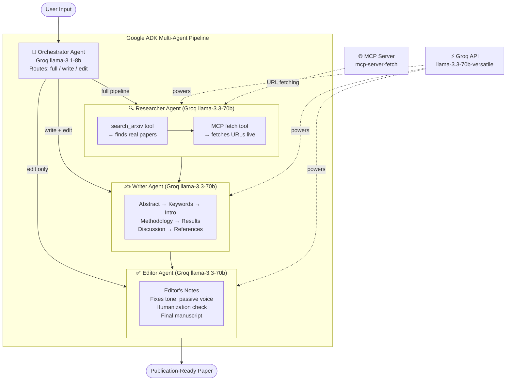

# ScholarAgent

> **Multi-Agent Academic Writing Pipeline** — Give it a topic, get a publication-ready research paper.

[](https://scholaragent-production.up.railway.app/app.html)
[](https://github.com/Tirumalashreya/ScholarAgent)
[](https://google.github.io/adk-docs/)
[](https://railway.app)

---

## What is ScholarAgent?

ScholarAgent is a **multi-agent AI system** that automates the entire academic writing process — from finding real research papers to producing a polished, publication-ready manuscript.

Built on **Google Agent Development Kit (ADK)**, it coordinates four specialized AI agents:

1. **Orchestrator** — Reads the user's request and decides the pipeline route
2. **Researcher** — Searches arXiv, fetches papers via MCP, writes a structured research report
3. **Writer** — Drafts a full academic paper (Abstract → References)
4. **Editor** — Polishes for academic tone, removes AI-pattern phrasing, verifies citations

---

## Architecture



---

## Tech Stack

| Layer | Technology |
|---|---|
| Agent Framework | Google ADK (Agent Development Kit) |
| LLM — Routing | Groq `llama-3.1-8b-instant` |
| LLM — Research / Writing / Editing | Groq `llama-3.3-70b-versatile` |
| Web Fetching | MCP (`mcp-server-fetch`) via `McpToolset` |
| Paper Discovery | Custom `search_arxiv` function tool |
| Backend | FastAPI + Uvicorn |
| Authentication | JWT (`python-jose`) + bcrypt |
| Database | SQLite + SQLAlchemy |
| Frontend | Vanilla JS + marked.js |
| Deployment | Railway |

---

## Three Pipelines

### Full Pipeline — Topic → Research → Write → Edit
Give a research topic. The Researcher searches arXiv for real papers, synthesizes a report, the Writer produces a full paper, and the Editor polishes it.

**Example prompt:**
```
Federated learning for privacy-preserving medical diagnosis in IoT healthcare systems
```

### Write Pipeline — Notes → Write → Edit
Paste your own research notes. The Writer and Editor produce a full paper from them.

**Example prompt:**
```
Here are my research notes:
- Transformer attention scales quadratically with sequence length
- FlashAttention reduces memory via IO-aware tiling
- Sparse attention trades recall for speed
Write this up as an academic paper.
```

### Edit Pipeline — Draft → Edit
Paste a complete draft. The Editor fixes tone, passive voice, citations, and AI-pattern phrasing.

---

## Live Demo

**https://scholaragent-production.up.railway.app/app.html**

1. Register an account
2. Enter a research topic or paste notes
3. Wait ~60–90 seconds
4. Get a full academic paper

---

## Running Locally

```bash
# 1. Clone the repo
git clone https://github.com/Tirumalashreya/ScholarAgent.git
cd ScholarAgent/adk_rebuild

# 2. Create virtual environment
python -m venv venv
source venv/bin/activate       # Windows: venv\Scripts\activate

# 3. Install dependencies
pip install -r ../requirements.txt

# 4. Set environment variables
cp .env.example .env
# Edit .env and add your GROQ_API_KEY

# 5. Start the server
uvicorn server:app --host 0.0.0.0 --port 8000

# 6. Open in browser
open http://localhost:8000/app.html
```

---

## Environment Variables

```env
GROQ_API_KEY=your_groq_api_key_here
JWT_SECRET=your_random_secret_key
DATABASE_URL=sqlite:///./data/papers.db
```

Get a free Groq API key at **console.groq.com** — 100K tokens/day free, resets at midnight UTC.

---

## Deployment (Railway)

### One-time setup

1. Push code to GitHub
2. Go to [railway.app](https://railway.app) → New Project → Deploy from GitHub → Select repo
3. Add environment variables in the **Variables** tab:
   - `GROQ_API_KEY`
   - `JWT_SECRET`
   - `DATABASE_URL`
4. Click **Deploy**

Railway auto-detects Python from `requirements.txt` and uses the `Procfile` start command.

### Key files for Railway

| File | Purpose |
|---|---|
| `requirements.txt` | Python dependencies (at repo root) |
| `Procfile` | Start command: `cd adk_rebuild && uvicorn server:app ...` |
| `railway.toml` | Restart policy configuration |

---

## Project Structure

```
ScholarAgent/
├── requirements.txt               # Python dependencies
├── Procfile                       # Railway start command
├── railway.toml                   # Railway config
└── adk_rebuild/
    ├── server.py                  # FastAPI server, auth, /chat endpoint
    ├── pipeline.py                # ADK orchestration + LLM routing
    ├── database.py                # SQLAlchemy models (User, Paper)
    ├── auth.py                    # JWT + bcrypt auth
    ├── agents/
    │   ├── research_agent.py      # Researcher — arXiv + MCP fetch
    │   ├── writer_agent.py        # Writer — academic paper drafting
    │   └── editor_agent.py        # Editor — polish + humanize
    ├── tools/
    │   └── research_tools.py      # search_arxiv function tool
    └── research-suite 2/          # Frontend
        ├── app.html
        ├── suite.js
        ├── suite.css
        └── paper.js
```

---

## How It Works — Under the Hood

```
User sends topic
    │
    ▼
Orchestrator (ADK LlmAgent) reads message
    │
    ├── "full"  → Researcher → Writer → Editor
    ├── "write" → Writer → Editor
    └── "edit"  → Editor only
         │
         ▼
Each agent runs inside ADK Runner + InMemorySessionService
         │
         ▼
Researcher calls search_arxiv (finds papers) + MCP fetch (reads URLs)
         │
         ▼
Writer receives research report → drafts full paper
         │
         ▼
Editor receives draft → returns Editor's Notes + corrected manuscript
         │
         ▼
FastAPI returns final paper to frontend
```

---

*Built with Google ADK · Powered by Groq · Deployed on Railway*
